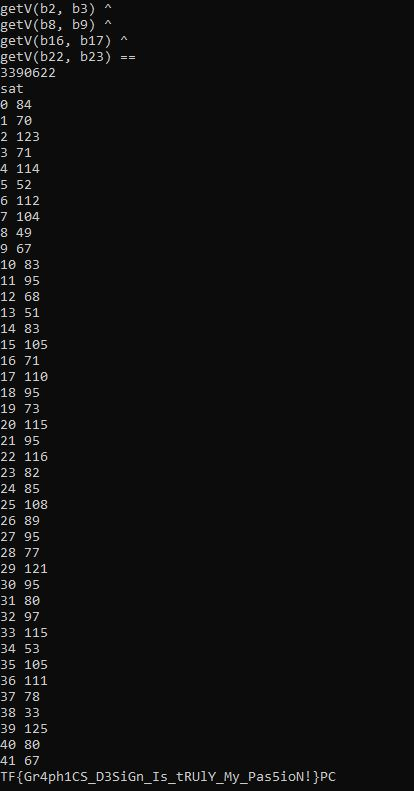

# YOU wa SHOCKWAVE - Rev 250pts

## Introduction
We were provided with an archive (you_wa_shockwave.gz) containing the following files:


Trying to open Projector.exe and inserting some random characters into input:


After some digging we discovered that the app was made with Adobe Director 10 and that the most important file was the one with .dcr extension, which contains some kind of bytecode/memory dump.

If you want to read more about how the .dcr file structure is made: https://medium.com/@nosamu/a-tour-of-the-adobe-director-file-format-e375d1e063c0

## Obtaining some code

Fortunately, someone had already reversed this type of file on GitHub.

We used [DCR2DIR](https://github.com/Brian151/OpenShockwave/tree/master/tools/imports) to convert the project to a DIR file, and then we uploaded it to [this online Lingo Decompiler](https://alex-dev.org/lscrtoscript/).

```
on check_flag(flag)
    if flag.length <> 42 then
        return(0)
    end if
    checksum = 0
    i = 1
    repeat while i <= 21
        checksum = bitXor(checksum, zz(charToNum(flag.getProp(#char, i * 2 - 1)) * 256 + charToNum(flag.getProp(#char, i * 2))))
        i = 1 + i
    end repeat
    if checksum <> 5803878 then
        return(0)
    end if
    check_data = [[2, 5, 12, 19, 3749774], [2, 9, 12, 17, 694990], [1, 3, 4, 13, 5764], [5, 7, 11, 12, 299886], [4, 5, 13, 14, 5713094], [0, 6, 8, 14, 430088], [7, 9, 10, 17, 3676754], [0, 11, 16, 17, 7288576], [5, 9, 10, 12, 5569582], [7, 12, 14, 20, 7883270], [0, 2, 6, 18, 5277110], [3, 8, 12, 14, 437608], [4, 7, 12, 16, 3184334], [3, 12, 13, 20, 2821934], [3, 5, 14, 16, 5306888], [4, 13, 16, 18, 5634450], [11, 14, 17, 18, 6221894], [1, 4, 9, 18, 5290664], [2, 9, 13, 15, 6404568], [2, 5, 9, 12, 3390622]]
    repeat while check_data <= 1
        x = getAt(1, count(check_data))
        i = x.getAt(1)
        j = x.getAt(2)
        k = x.getAt(3)
        l = x.getAt(4)
        target = x.getAt(5)
        sum = zz(charToNum(flag.getProp(#char, i * 2 + 1)) * 256 + charToNum(flag.getProp(#char, i * 2 + 2)))
        sum = bitXor(sum, zz(charToNum(flag.getProp(#char, j * 2 + 1)) * 256 + charToNum(flag.getProp(#char, j * 2 + 2))))
        sum = bitXor(sum, zz(charToNum(flag.getProp(#char, k * 2 + 1)) * 256 + charToNum(flag.getProp(#char, k * 2 + 2))))
        sum = bitXor(sum, zz(charToNum(flag.getProp(#char, l * 2 + 1)) * 256 + charToNum(flag.getProp(#char, l * 2 + 2))))
        if sum <> target then
            return(0)
        end if
    end repeat
    return(1)
    exit
end

on zz(x)
    return(zz_helper(1, 1, x).getAt(1))
    exit
end

on zz_helper(x,y,z)
    if y > z then
        return([1, z - x])
    end if
    c = zz_helper(y, x + y, z)
    a = c.getAt(1)
    b = c.getAt(2)
    if b >= x then
        return([2 * a + 1, b - x])
    else
        return([2 * a + 0, b])
    end if
    exit
end
```

Uh! So:

- The flag must be 42 character long
- The input to be a valid flag must pass some kind of custom checksum, which check 8 chars at a time.
  For example, given the first element of data_check ( [2, 5, 12, 19, 3749774] ), the check will be performed on 5th, 6th, 11th, 12th, 25th, 26th, 37th and 38th chars (see in the code i\*2+1, i\*2+2, etc).
  This makes a bruteforce hard to do... Or not?

## Coding time

My teammates (thanks @kzalloc and @gaspare) wrote a solver script in python (included file "solver.py"), introducing me to a module called z3. I had never heard of, but now I'm loving it. Given what he managed to do in this challenge, it seems to me a very powerful tool.

Basically, it was enough to translate functions from Lingo Code to Python and tell z3 some conditions (like that the flag characters must be included in the ASCII printable range and that the flag must pass the custom checksum function).

## The flag

After a few minutes of computation:



PCTF{Gr4ph1CS_D3SiGn_Is_tRUlY_My_Pas5ioN!}
